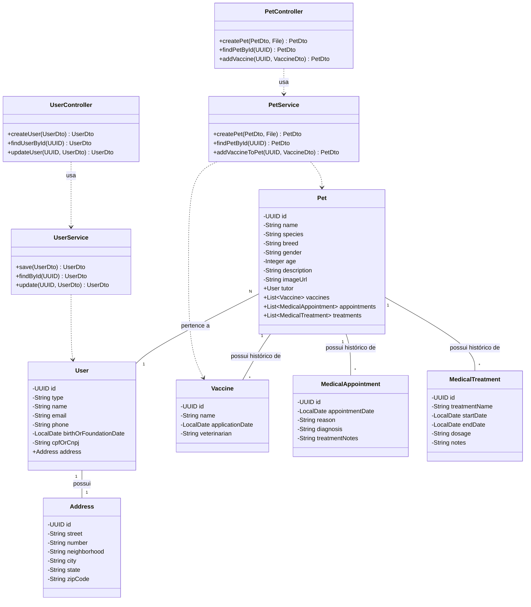

# 🐾 Pets+ (Back-End)

Este repositório contém o back-end da aplicação **Pet Connect**, um sistema desenvolvido em **Spring Boot com Java** para facilitar o gerenciamento de pets, suas carteirinhas de vacinação e o processo de adoção.

---

## 1. Principais Tecnologias

*   **Java 17**
*   **Spring Boot 3:** Para a estrutura da aplicação e injeção de dependência.
*   **Spring Data JPA & Hibernate:** Para persistência de dados.
*   **Spring Security:** Para autenticação e autorização via JWT.
*   **PostgreSQL:** Banco de dados relacional.
*   **Docker & Docker Compose:** Para containerização da aplicação.
*   **Maven:** Para gerenciamento de dependências.
*   **Swagger (OpenAPI 3):** Para documentação interativa da API.

---

## 2. Arquitetura e Diagrama de Classes

A aplicação backend segue uma arquitetura em camadas, promovendo desacoplamento e facilitando a manutenção.

*   **Controllers (`@RestController`):** A **porta de entrada** da API. Recebem requisições e chamam os `Services`.
*   **Services (`@Service`):** O **cérebro** da aplicação. Contêm a lógica de negócio e gerenciam as `Entidades`.
*   **Entidades (`@Entity`):** A **estrutura dos dados** no banco, como `User`, `Pet` e a carteirinha digital.

### Legenda do Diagrama
*   `-->` (Linha Sólida): **Associação entre Entidades**.
*   `..>` (Linha Pontilhada): **Dependência/Uso**.

### Diagrama


---

## 3. Como Executar o Projeto

### Pré-requisitos
- **Docker** e **Docker Compose**

### Passos
1.  **Clonar o Repositório**
    ```bash
    git clone https://github.com/Attonic/pet-connect-be.git
    cd pet-connect-be
    ```

2.  **Iniciar a Aplicação com Docker**
    Na raiz do projeto, execute o comando abaixo.
    ```bash
    docker-compose up -d --build
    ```

---

## 4. Documentação da API (Swagger)

Com a aplicação em execução, a documentação interativa da API estará disponível através do Swagger UI.

Acesse pelo seu navegador local:

**[http://localhost:8080/swagger-ui.html](http://localhost:8080/swagger-ui.html)**

> **Nota:** Se estiver usando um ambiente de desenvolvimento em nuvem (como o Google Cloud Workstations), ele gerará uma URL pública para a porta 8080, que também pode ser usada para acessar o Swagger.

---

## 5. Front-End da Aplicação
Para acessar o repositório do front-end, visite: **[Pet Connect / Front-End](https://github.com/BrunnoCarvalho/pet-connect-fe.git)**

---

**Desenvolvido pela equipe Pets+ 🐾**
