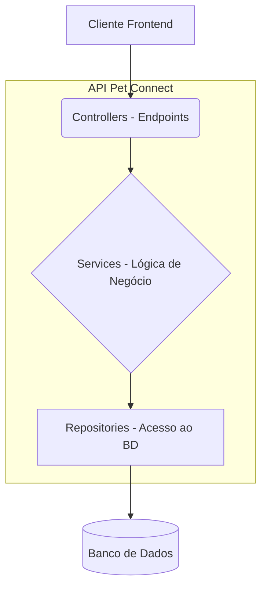

# Documentação Técnica e de Negócio: Pet Connect

## 1. Visão Geral e Objetivo

**Pet Connect** é uma plataforma web centralizada para o gerenciamento digital de dados de saúde e adoção de animais, projetada para ONGs, tutores e veterinários.

### O Problema Resolvido
A plataforma ataca três problemas centrais no cuidado com animais:
1.  **Informações Médicas Descentralizadas:** Históricos de saúde de pets frequentemente se perdem ou ficam espalhados entre diferentes clínicas e documentos físicos.
2.  **Gestão de ONGs:** ONGs e abrigos enfrentam dificuldades para controlar o histórico de um grande número de animais, incluindo os já adotados.
3.  **Falta de Ferramentas para Tutores:** Tutores não possuem uma maneira fácil e digital de registrar e acessar o histórico de saúde completo de seus pets.

### Perfis de Usuário
O sistema é construído para atender às necessidades de quatro perfis principais:
*   **Tutor:** Cadastra seus pets, gerencia a carteirinha digital, pode disponibilizar um animal para adoção e conceder acesso à carteirinha para veterinários.
*   **ONG:** Gerencia um perfil público com a lista de pets (ativos e adotados), cadastra novos animais, atualiza suas carteirinhas e acompanha o histórico de adoções.
*   **Veterinário:** Acessa e atualiza os dados médicos da carteirinha de um pet, mediante permissão concedida pelo tutor ou ONG.
*   **Visitante:** Navega na vitrine pública de adoção e pode criar uma conta ao manifestar interesse em adotar um animal.

## 2. Arquitetura e Diagramas

A aplicação backend segue uma arquitetura em camadas (MVC adaptado para APIs), utilizando Spring Boot.

### Diagramas de Classe

(Os diagramas de classe para os módulos de `Usuário/Endereço` e `Pet` permanecem os mesmos da versão anterior, ilustrando as relações entre Entidades, DTOs e Serviços.)

## 3. Lógica das Funcionalidades Principais

*   **Carteirinha Digital:** O núcleo do sistema, contendo o histórico de saúde completo do pet (vacinas, consultas, tratamentos).
*   **Adoção Consciente:** ONGs e tutores podem listar pets para adoção. Os perfis dos animais são enriquecidos com seu histórico de saúde, promovendo uma adoção mais informada.
*   **Controle de Acesso:** A funcionalidade de permissões (ainda a ser implementada) permitirá que tutores e ONGs controlem qual veterinário pode visualizar ou editar a carteirinha de um pet.

## 4. Status do Projeto e Pendências do Backend

Esta seção serve como um registro vivo do trabalho a ser feito na API.

| Pendência | Status | Detalhes |
| :--- | :--- | :--- |
| **Erros no Cadastro de Usuário** | ✅ **Resolvido** | Corrigidos problemas relacionados a campos nulos (senha, endereço) e padronizado o formato de data (`yyyy-MM-dd`) para evitar erros de desserialização. |
| **Retorno de Tratativas para o Frontend** | ⏳ **Pendente** | Implementar um `Global Exception Handler` (`@RestControllerAdvice`) para padronizar as respostas de erro da API (ex: "Usuário já cadastrado", "Recurso não encontrado"). |
| **Implementação de Segurança (JWT)** | ⏳ **Pendente** | Adicionar Spring Security para proteger os endpoints. Implementar a geração e validação de JSON Web Tokens (JWT) para autenticação e autorização de usuários. |
| **Implementação do Modelo Conceitual do BD** | ⏳ **Pendente** | Refinar e expandir as entidades JPA (`@Entity`) para refletir completamente o modelo conceitual do banco de dados, incluindo novas entidades como `Tratamento`, `Vacina`, `Adocao`, etc. |
| **Armazenamento de Arquivos em Produção** | ⚠️ **Alerta** | A implementação atual do `FileStorageService` salva arquivos localmente. Para produção, **é crítico** substituir esta lógica por um serviço de armazenamento em nuvem (ex: AWS S3, Google Cloud Storage) para garantir escalabilidade e persistência dos dados. |

